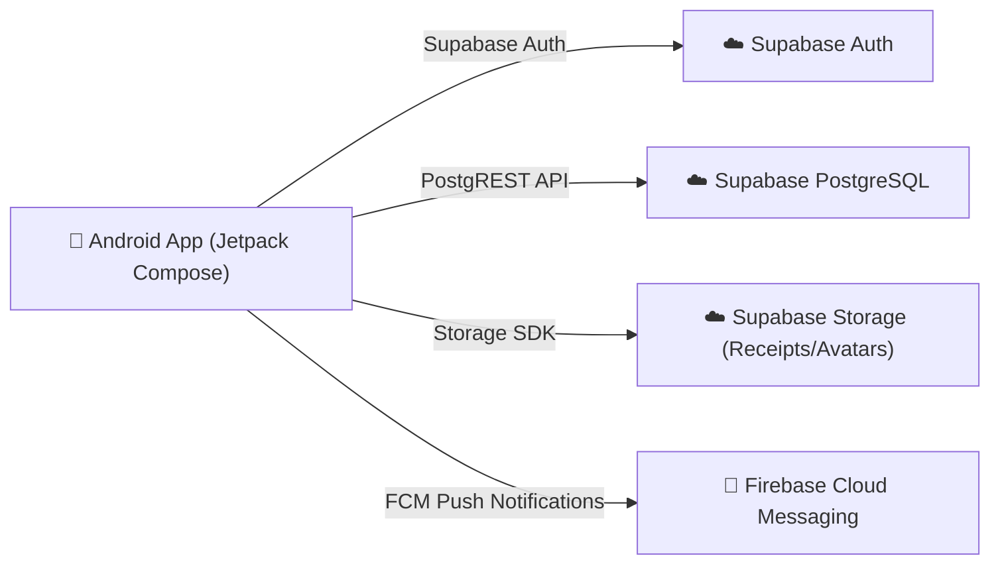

# 📱 SplitBill - Ứng dụng Quản lý & Chia tiền Nhóm

SplitBill là ứng dụng Android hiện đại giúp các nhóm bạn bè, đồng nghiệp hoặc người thân dễ dàng ghi nhận hóa đơn, theo dõi chi tiêu và tối ưu hóa các khoản nợ chéo.

---

## 🏗️ Kiến trúc Hệ thống (Serverless với Supabase)

Ứng dụng hoạt động theo mô hình **Client ↔ BaaS (Backend-as-a-Service)** trực tiếp với **Supabase Cloud**, không yêu cầu chạy backend server cục bộ:



* **Frontend:** Kotlin, Jetpack Compose, Material 3, Coroutines, Navigation 3, DataStore.
* **Backend & Database:** Supabase Cloud (PostgreSQL với Row Level Security - RLS).
* **Storage:** Supabase Storage (Buckets: `avatars`, `receipts`).
* **Thuật toán Tối giản nợ (Debt Simplification):** Greedy 2 Max-Heaps chạy trực tiếp client-side để tối ưu hóa số giao dịch trả nợ tối thiểu (tối đa N-1 giao dịch).

---

## 🚀 Hướng dẫn Cài đặt & Chạy ứng dụng

### 1. Chuẩn bị
* Android Studio Ladybug / Meerkat (hoặc tương đương)
* JDK 17
* Dự án Supabase (đã cấu hình schema qua `supabase_schema.sql`)

### 2. Cấu hình Supabase Key
Tạo hoặc mở file `android/local.properties` và điền `anon` key từ Supabase Dashboard:

```properties
sdk.dir=D\:\\App\\AndroidSDK
supabase.anon.key=eyJhbGciOiJIUzI1NiIsInR5cCI6IkpXVCJ9...
```

### 3. Biên dịch ứng dụng
Mở terminal tại thư mục `android/` và chạy:

```powershell
./gradlew assembleDebug
```

File APK sẽ được tạo tại `android/app/build/outputs/apk/debug/app-debug.apk`.
Mở trực tiếp trên điện thoại hoặc máy ảo Android để sử dụng ngay mà không cần khởi động bất kỳ server backend nào!
